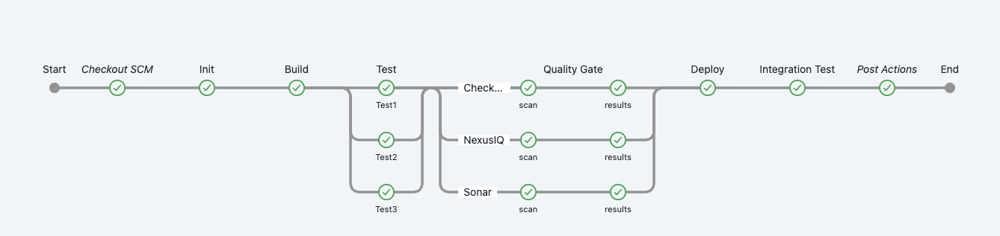
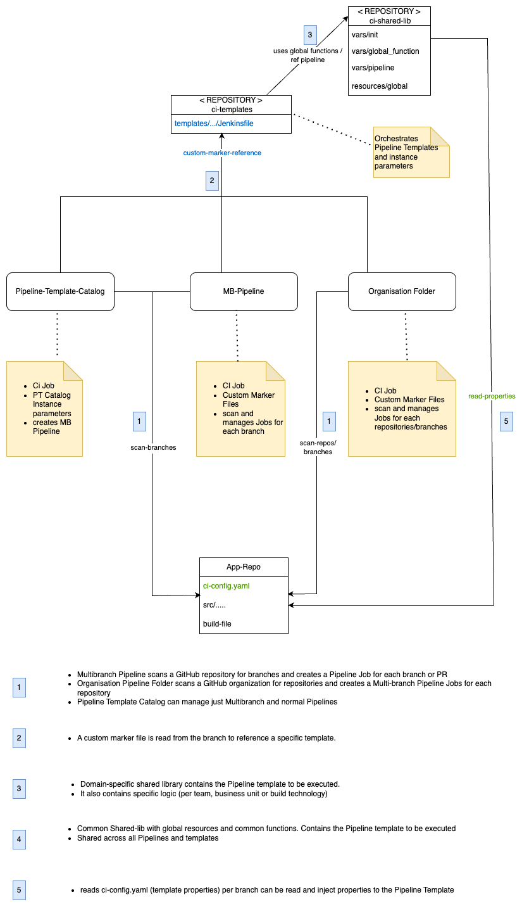

# 🧪 About

This repository contains **CloudBees CI Pipeline Templates**, intended for reuse across CI/CD projects. These templates can be referenced from:

- [Marker files](https://docs.cloudbees.com/docs/cloudbees-ci/latest/pipelines/pipeline-as-code#custom-pac-scripts) in:
  - [MultiBranch Pipeline Projects](https://docs.cloudbees.com/docs/cloudbees-ci/latest/pipelines/pipeline-as-code#_multibranch_pipeline_projects)
  - [Pipeline Organization Folders](https://docs.cloudbees.com/docs/cloudbees-ci/latest/pipelines/pipeline-as-code#_organization_folders)
  - [Pipeline Template Catalogs](https://docs.cloudbees.com/docs/cloudbees-ci/latest/pipeline-templates-user-guide/)

### ✨ Purpose

- Provide an opinionated CI pipeline structure with clearly defined stages and phases (see diagram below).
- Simplify pipeline adoption with minimal external dependencies.
- Enable real-world usage through a sample [Spring Boot app](https://github.com/cb-ci-templates/sample-app-spring-boot-maven), which includes:
  - A simple [`ci-config.yaml`](https://github.com/cb-ci-templates/sample-app-spring-boot-maven/blob/main/ci-config.yaml) used as a custom marker and configuration file.
  - A connection to [this template](https://github.com/cb-ci-templates/ci-templates/blob/main/templates/mavenMultiBranch/Jenkinsfile) for CI execution (e.g., clone, build, push).



---

## 📦 Templates in This Repository

| Template                        | Description                                                                                                                    |
|----------------------------------|--------------------------------------------------------------------------------------------------------------------------------|
| [`0-helloWorldSimple`](templates/0-helloWorldSimple) | Pipeline template that utilizes a shared library and runs on a Kubernetes agent. 
The pipeline executes a series of custom `helloworld`  steps inside a custom container.                                                                        |
| [`1-multiBranch`](templates/1-multiBranch)           | Hello World using Multibranch                                                                                                  |
| [`2-multiBranch`](templates/2-multiBranch)           | Extension of `1-multiBranch` uses Pipeline instance parameters.                                                                    |
| [`3-multiBranch`](templates/3-multiBranch)           | Full Spring Boot pipeline with: <br>• custom marker config.yaml <br>• Maven build <br>• Docker image build & push via Kaniko. scan on [`sample-app-helloworld`](https://github.com/cb-ci-templates/sample-app-helloworld).  |

---

## ⚡ Quick Start

To get started quickly, see the [casc directory](casc/) for setup and configuration examples.

---

## 🗂️ Repository Structure

This repository follows the recommended layout for Pipeline Template Catalogs. Templates are under `/templates`, and each contains:

- `Jenkinsfile`: A Pipeline definition (Declarative or Scripted).
- `template.yaml`: Template parameters (required only for Template Catalogs).

```text
├── README.md
├── catalog.yaml              # Pipeline Template Catalog descriptor
└── templates/                # Template catalog
    ├── helloWorldSimple/
    │   ├── Jenkinsfile       # Main pipeline file
    │   ├── README.md
    │   └── template.yaml     # Template descriptor (optional)
    └── ...
```

---

## 🧱 Component Diagram



_TODO: Add description and technical design._

---

## 🧩 Custom Marker Files & Pipeline Templates

This diagram explains how marker files integrate with templates:


---

## ⚙️ Job Settings: Branch Suppression Strategies

Suppress automatic triggering for all branches, except PRs:

```yaml
strategy:
  namedBranchesDifferent:
    defaultProperties:
      - suppressAutomaticTriggering:
          triggeredBranchesRegex: ^.*$
          strategy: INDEXING
    namedExceptions:
      - named:
          name: PR-\d+
          props:
            - suppressAutomaticTriggering:
                triggeredBranchesRegex: ''
                strategy: NONE
```

---

## 📚 Documentation & Videos

### Pipeline Best Practices

- 📝 [Just Enough Pipeline](https://www.jenkins.io/blog/2021/10/26/just-enough-pipeline/)
- 📘 [CloudBees CI Pipeline Best Practices](https://docs.cloudbees.com/docs/cloudbees-ci/latest/pipelines/pipeline-best-practices)
- 🎥 [Scripted vs. Declarative Pipelines – YouTube](https://www.youtube.com/watch?v=GJBlskiaRrI=)
- 🧠 [Scripted vs. Declarative - Blog](https://e.printstacktrace.blog/jenkins-scripted-pipeline-vs-declarative-pipeline-the-4-practical-differences/)

### Multibranch Pipelines

- 🎥 [How to Create a GitHub Multibranch Pipeline – YouTube](https://www.youtube.com/watch?v=ZWwmh4gqia4)
- 📘 [CloudBees Docs: Multibranch Pipelines](https://docs.cloudbees.com/docs/cloudbees-ci/latest/pipelines/pipeline-as-code#_multibranch_pipeline_projects)

### Template Catalogs

- 🎥 [Pipeline Template Catalogs – YouTube](https://www.youtube.com/watch?v=pPwI_kTSCmA)
- 📘 [Pipeline Template Catalogs Docs](https://docs.cloudbees.com/docs/cloudbees-ci/latest/pipeline-templates-user-guide/)

### Organization Folders

- 🎥 [Create GitHub Org Folder – YouTube](https://www.youtube.com/watch?v=w5YupbQ1vHI)
- 📘 [CloudBees Docs: Org Folders](https://docs.cloudbees.com/docs/cloudbees-ci/latest/pipelines/pipeline-as-code#_organization_folders)

### Marker Files

- 📘 [Marker Files](https://docs.cloudbees.com/docs/cloudbees-ci/latest/pipelines/pipeline-as-code#custom-pac-scripts)
- 🧠 [Using Marker Files for Governance](https://www.cloudbees.com/blog/ensuring-corporate-standards-pipelines-custom-marker-files)

### GitHub App Authentication

- 🔐 [Using GitHub App Authentication](https://docs.cloudbees.com/docs/cloudbees-ci/latest/traditional-admin-guide/github-app-auth)
