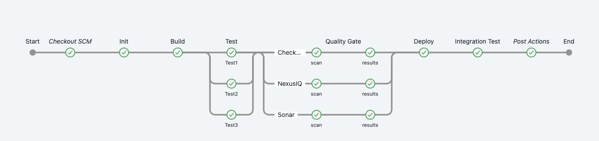
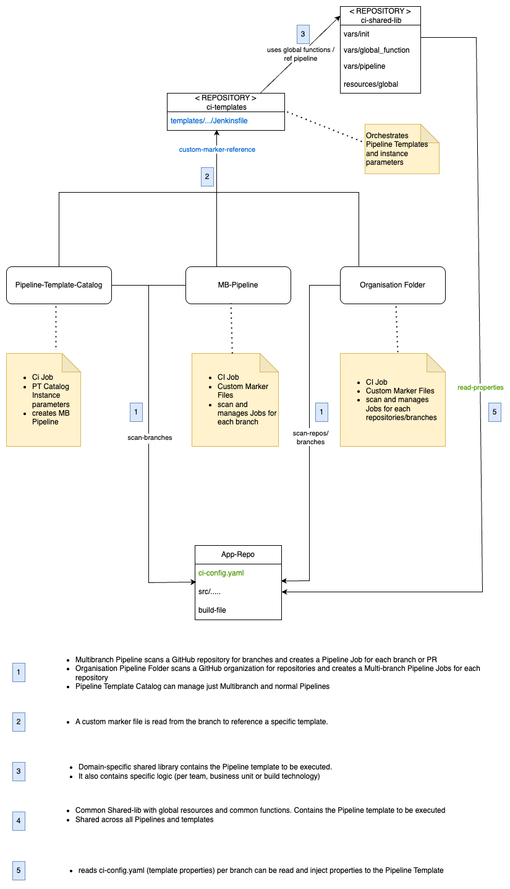
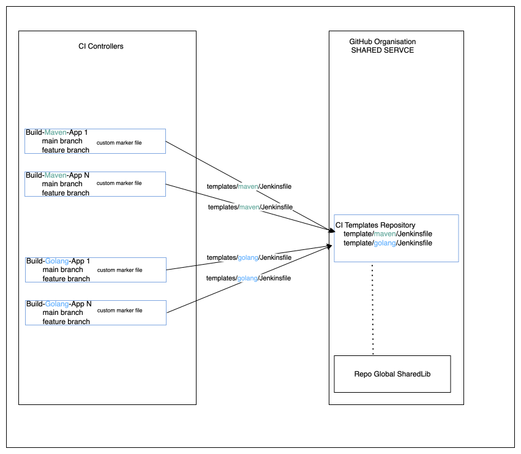

# 🚀 CloudBees CI Pipeline Templates

An opinionated collection of **Enterprise Pipeline Templates** designed for consistency, security, and rapid developer onboarding within CloudBees CI environments.

---

## ⚡ Quick Start

Get your first templated pipeline running in minutes:

1.  **Configure Environment**: See the [casc/ directory](casc/) for configuration-as-code examples to setup your controller.
2.  **Select a Template**: Browse the [Templates](#-templates-in-this-repository) below.
3.  **Deploy**: Reference these templates from your [Pipeline Template Catalog](https://docs.cloudbees.com/docs/cloudbees-ci/latest/pipeline-templates-user-guide/) or use [Custom Marker Files](https://docs.cloudbees.com/docs/cloudbees-ci/latest/pipelines/pipeline-as-code#custom-pac-scripts).

> [!TIP]
> For a real-world example, check out the [Spring Boot Sample App](https://github.com/cb-ci-templates/sample-app-spring-boot-maven) which uses a `ci-config.yaml` marker to trigger these templates.

---

## 📦 Templates in This Repository

| Template | Capabilities | Reference |
| :--- | :--- | :--- |
| **0-helloWorldSimple** | Basic K8s agent execution, custom steps | [`Link`](templates/0-helloWorldSimple) |
| **1-multiBranch** | Multi-branch foundational pipeline | [`Link`](templates/1-multiBranch) |
| **2-multiBranch** | Advanced Multi-branch with Instance Parameters | [`Link`](templates/2-multiBranch) |
| **3-multiBranch** | Full Maven Lifecycle: Build, Kaniko Push, Security Scan | [`Link`](templates/3-multiBranch) |

> [!NOTE]
> All templates reference a centralized [Shared Library](https://github.com/cb-ci-templates/ci-shared-library) to ensure DRY (Don't Repeat Yourself) logic.

---

## 🏛️ Visual Architecture

### 1. CI Pipeline Flow
Standardized stages ensure every build follows your organization's quality gates.


### 2. Component Diagram
High-level overview of how templates, shared libraries, and controllers interact.


### 3. Custom Marker Mapping
Understand how "Many Jobs" can be governed by "One Template".


---

## ⚙️ Enterprise Configuration

### Branch Suppression Strategies
Prevent unwanted triggers on standard branches while allowing PR-based builds:
```yaml
strategy:
  namedBranchesDifferent:
    defaultProperties:
      - suppressAutomaticTriggering:
          triggeredBranchesRegex: ^.*$
          strategy: INDEXING
    namedExceptions:
      - named:
          name: PR-\d+
          props:
            - suppressAutomaticTriggering:
                triggeredBranchesRegex: ''
                strategy: NONE
```

### Git Reference Repositories
Optimization for large repositories. [Learn more](https://docs.cloudbees.com/docs/cloudbees-ci-kb/latest/client-and-managed-controllers/how-to-create-and-use-a-git-reference-repository).

---

## 📚 Resources & Learning

### Core Concepts
| Category | Resources |
| :--- | :--- |
| **Best Practices** | [Just Enough Pipeline](https://www.jenkins.io/blog/2021/10/26/just-enough-pipeline/) • [CloudBees Best Practices](https://docs.cloudbees.com/docs/cloudbees-ci/latest/pipelines/pipeline-best-practices) |
| **Governance** | [Using Marker Files](https://www.cloudbees.com/blog/ensuring-corporate-standards-pipelines-custom-marker-files) • [Template Catalogs](https://docs.cloudbees.com/docs/cloudbees-ci/latest/pipeline-templates-user-guide/) |
| **Authentication** | [GitHub App Auth](https://docs.cloudbees.com/docs/cloudbees-ci/latest/traditional-admin-guide/github-app-auth) |

### Video Guides
- 🎥 [Scripted vs. Declarative Pipelines](https://www.youtube.com/watch?v=GJBlskiaRrI=)
- 🎥 [Creating GitHub Multibranch Pipelines](https://www.youtube.com/watch?v=ZWwmh4gqia4)
- 🎥 [Pipeline Template Catalogs deep-dive](https://www.youtube.com/watch?v=pPwI_kTSCmA)

---

## 🗂️ Repository Structure

This repository follows the standard layout for CloudBees Pipeline Template Catalogs:
```text
├── catalog.yaml              # Catalog definition
├── casc/                     # Configuration as Code
└── templates/                # Individual templates
    └── [name]/
        ├── Jenkinsfile       # Pipeline logic
        ├── template.yaml     # Catalog metadata
        └── README.md         # Template-specific docs
```
