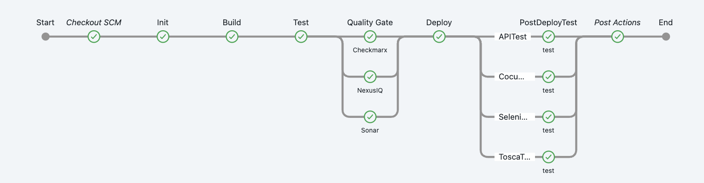

# About 
This repository contains CloudBees CI Pipeline Templates.
It can be referenced from:

* [Marker files](https://docs.cloudbees.com/docs/cloudbees-ci/latest/pipelines/pipeline-as-code#custom-pac-scripts) in 
  * [MultiBranchSource Pipelines](https://docs.cloudbees.com/docs/cloudbees-ci/latest/pipelines/pipeline-as-code#_multibranch_pipeline_projects)
  * [Pipeline Organisation Folders](https://docs.cloudbees.com/docs/cloudbees-ci/latest/pipelines/pipeline-as-code#_organization_folders)
  * [Pipeline Template catalogs](https://docs.cloudbees.com/docs/cloudbees-ci/latest/pipeline-templates-user-guide/)

* The goal is to show an opinionated Pipeline templates approach with proper CI stages and phases as shown in the diagram below
* The implementation of steps has sample character, so the setup is as easy as it can bee with a few dependencies to other environment systems
* A sample [spring-boot application](https://github.com/cb-ci-templates/sample-app-spring-boot-maven) is part of [this github organisation](https://github.com/cb-ci-templates)
  * It contains a simple [ci-config.yaml](https://github.com/cb-ci-templates/sample-app-spring-boot-maven/blob/main/ci-config.yaml) used as a custom marker and config file (used as properties for the template)
  * The sample spring-boot app repo will be scanned by one of the supported job types
  * It will be referenced by an instance of this [template](https://github.com/cb-ci-templates/ci-templates/blob/main/templates/mavenMultiBranch/Jenkinsfile) for the CI work (clone, build, push etc.)



## Quick Start

For quickstart and setup steps, see [casc](casc/)

# Structure 
The repository structure follows the recommended repository design for Pipeline Template catalogs, however, the Jenkinsfiles can be referenced as well from MultiBranch and Organisation Folder Pipelines (Custom Marker).
Pipeline Templates are stored under the `/templates` folder, and each Pipeline Template is defined as a `subfolder` containing two files:

* Jenkinsfile: A standard Pipeline `Jenkinsfile`, which supports either Declarative Pipeline syntax or Groovy scripting.
* template.yaml: A YAML file containing the template’s parameters. This file is just required when using Pipeline Template Catalogs, not required when referencing from Custom Marker files

```
├── README.md
├── catalog.yaml #Pipeline Template Catalog descriptor
└── templates  # Pipeline Tenplate Catalog
   ├── helloWorldSimple  #tenplate folder
   │   ├── Jenkinsfile # Jenkins file used as temlate
   │   │── README.md    
   │   └── template.yaml #Pipeline Template descriptor
   ├── ....  # more template folders 

```
# Component diagram


TODO: description and design

# Custom marker files and Pipeline templates


 

# Notes: Job settings

##  Branch Suppress Strategies

```
strategy:
  namedBranchesDifferent:
    defaultProperties:
    - suppressAutomaticTriggering:
        triggeredBranchesRegex: ^.*$
        strategy: INDEXING
    namedExceptions:
    - named:
        name: PR-\d+
        props:
        - suppressAutomaticTriggering:
            triggeredBranchesRegex: ''
            strategy: NONE
```

# Docs & Videos

Pipeline Best Practice
* [just-enough-pipeline](https://www.jenkins.io/blog/2021/10/26/just-enough-pipeline/)
* [CloudBees Pipeline BestPractice](https://docs.cloudbees.com/docs/cloudbees-ci/latest/pipelines/pipeline-best-practices)
* YouTube: [Scripted vs. declarative Pipelines: What is the difference?](https://www.youtube.com/watch?v=GJBlskiaRrI=)
* [Scripted vs. declarative Pipelines](https://e.printstacktrace.blog/jenkins-scripted-pipeline-vs-declarative-pipeline-the-4-practical-differences/)

MultiBranchSource Pipelines
* YouTube: [How to Create a GitHub Branch Source Multibranch Pipeline in CloudBees CI](https://www.youtube.com/watch?v=ZWwmh4gqia4)
* [MultiBranchSource Pipelines](https://docs.cloudbees.com/docs/cloudbees-ci/latest/pipelines/pipeline-as-code#_multibranch_pipeline_projects)

Pipeline Template Catalogs
* YouTube: [Introduction to Pipeline Template Catalogs with CloudBees CI](https://www.youtube.com/watch?v=pPwI_kTSCmA)
* [Pipeline Template catalogs](https://docs.cloudbees.com/docs/cloudbees-ci/latest/pipeline-templates-user-guide/)

Pipeline Organisation Folders
* YouTube: [How to Create a GitHub Organization in CloudBees CI](https://www.youtube.com/watch?v=w5YupbQ1vHI)
* [Pipeline Organisation Folders](https://docs.cloudbees.com/docs/cloudbees-ci/latest/pipelines/pipeline-as-code#_organization_folders)

MarkerFiles
* [Marker files](https://docs.cloudbees.com/docs/cloudbees-ci/latest/pipelines/pipeline-as-code#custom-pac-scripts)
* [ensuring-corporate-standards-pipelines-custom-marker-files](https://www.cloudbees.com/blog/ensuring-corporate-standards-pipelines-custom-marker-files)

GitHub App Authentication
* [Using GitHub App authentication](https://docs.cloudbees.com/docs/cloudbees-ci/latest/traditional-admin-guide/github-app-auth)
